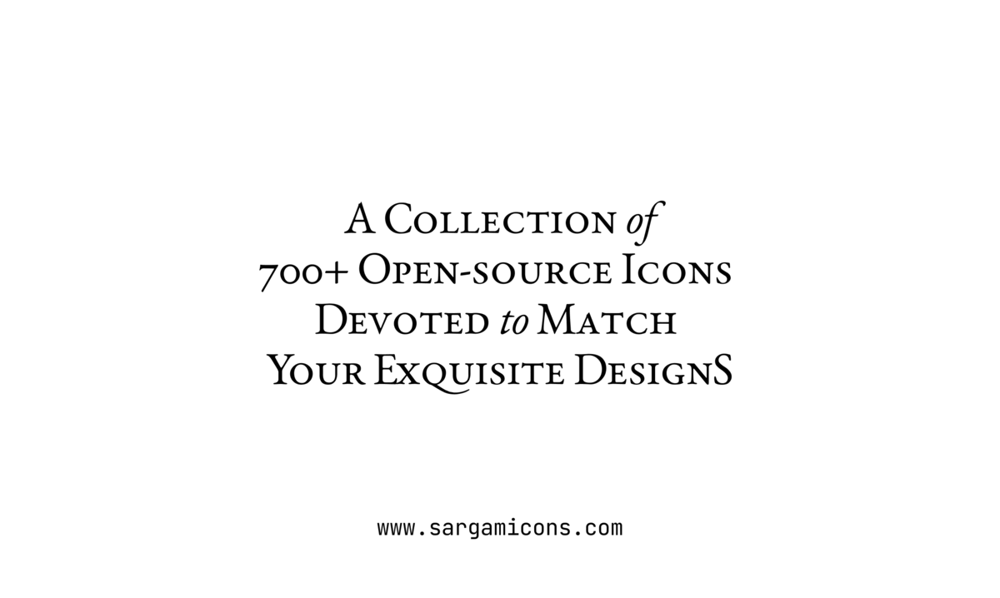

[sargamicons.com](https://sargamicons.com/)

# Sargam Icons React
Our collection of 250+ icons has been carefully crafted to exude minimalism and elegance. Each icon has been designed on a 24 x 24 grid with simplicity, consistency, and flexibility in mind, to meet your essential web, app, and visual needs.

- Over 250 free, open-source icons available for any use.
- Graceful design with emphasis on simplicity & consistency.
- Built using SVG stroke, providing maximum flexibility on styling.
- Optimized SVG assets for better web performance.

### Build Icons
```npm run build```

### Use Icons
- Line: `dist/index.js`
- Duotone: `dist/index2.js`
- Fill: `dist/index3.js`

---

- [sargamicons.com](https://sargamicons.com/)
- [Get a Figma copy](https://www.figma.com/community/file/1152296792728333709)
- [Download SVGs](https://github.com/planetabhi/sargam-icons/tree/main/Icons)