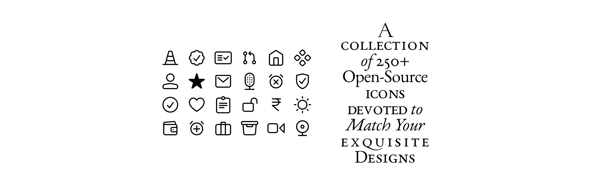

# Sargam icons for React.js 
Part of [Sargam Icons](https://github.com/planetabhi/sargam-icons) ∠( ᐛ 」∠)_

### Install
- [Get a Figma copy](https://www.figma.com/community/file/1152296792728333709)
- `npm i @sargamdesign/icons-react`

### Usage
- Line `dist/index.js`
- Duotone `dist/index2.js`
- Fill `dist/index3.js`